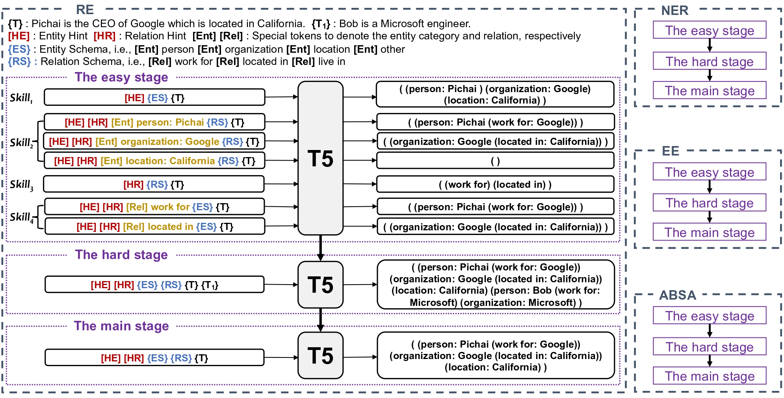

# Easy-to-Hard Learning for Information Extraction


Code for paper [Easy-to-Hard Learning for Information Extraction](https://arxiv.org/abs/2305.09193) (Findings of ACL 2023).



Information extraction (IE) systems aim to automatically extract structured information, such as named entities, relations between entities, and events, from unstructured texts. While most existing work addresses a particular IE task, universally modeling various IE tasks with one model has achieved great success recently. Despite their success, they employ a one-stage learning strategy, i.e., directly learning to extract the target structure given the input text, which contradicts the human learning process. In this paper, we propose a unified easy-to-hard learning framework consisting of three stages, i.e., the easy stage, the hard stage, and the main stage, for IE by mimicking the human learning process. By breaking down the learning process into multiple stages, our framework facilitates the model to acquire general IE task knowledge and improve its generalization ability.  Extensive experiments across four IE tasks demonstrate the effectiveness of our framework. We achieve new state-of-the-art results on 13 out of 17 datasets.


## Prepare the environment

Please run the following commands:

``````
conda create -n E2H python=3.8
pip install torch==1.8.0+cu111 torchvision==0.9.0+cu111 torchaudio==0.8.0 -f https://download.pytorch.org/whl/torch_stable.html
pip install -r requirements.txt
pip install wandb
``````
Experiments are done on NVIDIA Tesla A100 80G.


## Prepare datasets

For datasets that are publicly available, we put the processed datasets in ```./dataset_processing/converted_data```. For those datasets that are not publicly avaliable,
please follow steps [here](https://github.com/universal-ie/UIE/tree/main/dataset_processing) to obtain them.

After that, please link the preprocessed datasets as:
``` bash
ln -s dataset_processing/converted_data/ data
```

To obtain datasets used in low-resource scenarios, please run the following commands:

``````
cd dataset_processing
bash run_sample.bash
``````


## Training and Evaluation
Setup your W&B account following [this tutorial](https://docs.wandb.ai/quickstart).
Afterwards, uncomment the `wandb.init()` and `wandb.config.update()` statements in `skill_{entity/relation/event/aste}.py` and use your own entity and project names.

For training and evaluation, please run the following command
``````
bash run_e2h.bash {model size} {dataset} {task}
``````
Choose the model size from `base` and `large`, and (task, dataset) pairs from the following table.

| Task  | Dataset |
| ------------- | ------------- |
| entity  | conll03 |
| entity  | ace04ent   |
| entity  | ace05ent |
| relation  | conll04  |
| relation  | scierc |
| relation  | ace05rel |
| event  | ace05e |
| event  | ace05e+ |
| event  | casie |
| aste  | 14lap |
| aste  | 14res |
| aste  | 15res |
| aste  | 16res |

For training and evaluation in low-resource scenarios, please run the following command
``````
bash run_e2h_ratio.bash {model size} {dataset} {task}
``````

After training, for each (model_size, task, dataset) triplet, there will be a directory corresponding to it. 
This directory will contain many prediction folders and a file named `best.performance.now` that summarizes the results.
Please check `./config`, `run_exp_e2h.bash`, `run_exp_e2h_ratio.bash`, `e2h.bash`, and `e2h_ratio.bash` for details.

## Citation
If you find the code helpful, please cite the following paper:

```
@misc{gao2023easytohard,
      title={Easy-to-Hard Learning for Information Extraction}, 
      author={Chang Gao and Wenxuan Zhang and Wai Lam and Lidong Bing},
      year={2023},
      eprint={2305.09193},
      archivePrefix={arXiv},
      primaryClass={cs.CL}
}
```

## Acknowledgement

This implementation is based on the code of [UIE](https://github.com/universal-ie/UIE). Thanks for their contributions.
